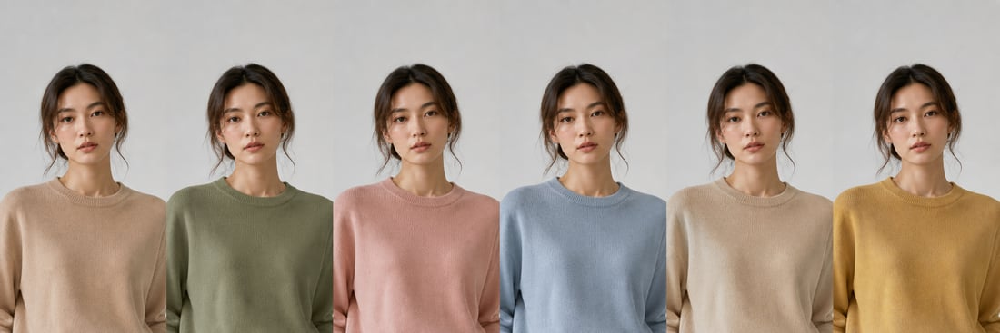
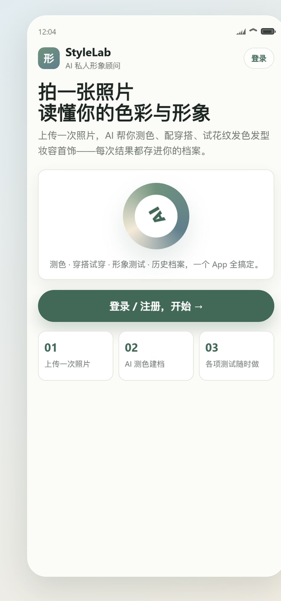
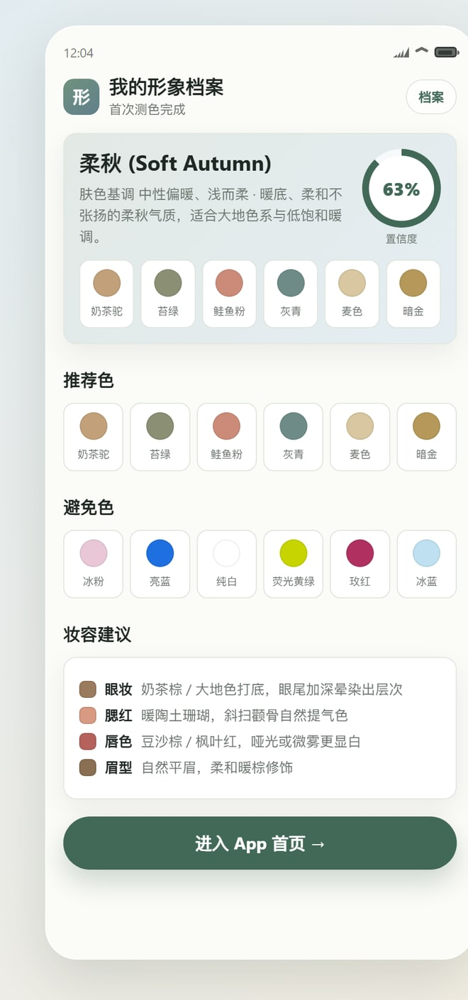
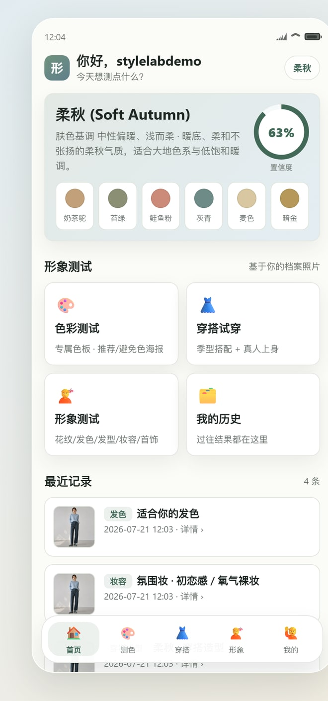
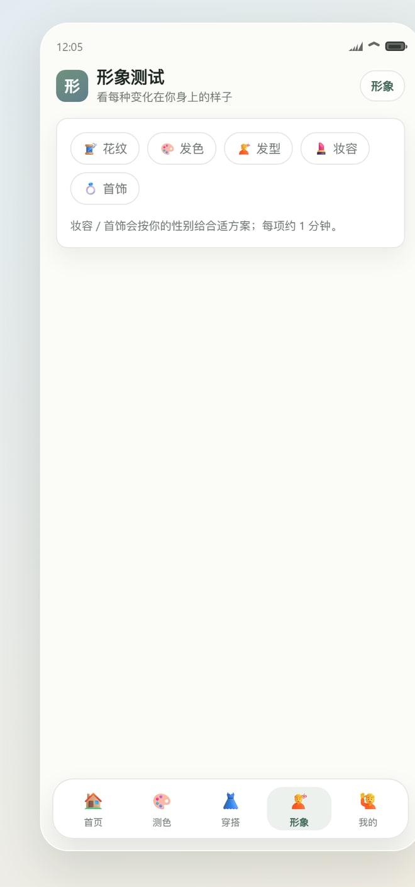
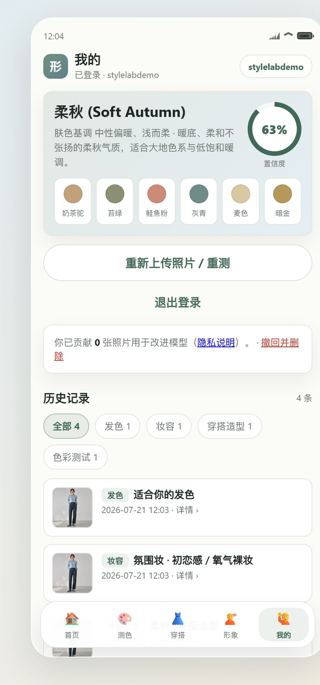

# StyleLab · AI 私人形象顾问

上传一张照片，AI 帮你 **测色（12 季型）→ 配穿搭 → 形象测试（花纹/发色/发型/妆容/首饰）→ 把效果直接生成在你本人身上**，并存进你的历史档案。

一个探索性的个人项目：**零依赖 Node 后端 + 原生 JS 前端**，所有 AI 能力走同一个 OpenAI 兼容反代（GPT-5 多模态看图 + gpt-image 图像编辑）。

- 🔗 线上体验：<https://sg.yaoyuheng2001.me/colorstyle/app.html>
- 📝 项目解读长文（体验 + 技术 + 评测）：[中文](https://sg.yaoyuheng2001.me/posts/stylelab/) · [English](https://sg.yaoyuheng2001.me/posts/stylelab/en/)

<p align="center">
  
  <br><em>AI 生成 · 柔秋推荐色色带：同一张脸、六种颜色，全程保脸</em>
</p>

> ⚠️ 个人探索项目，非商用；测色仅供娱乐/参考——季型判定**没有客观 ground-truth**，请当作有趣的起点而非权威结论。

---

## 核心理念

> **上传一次照片 → AI 建一份"形象档案" → 之后所有测试都复用这张照片，把效果直接生成在你身上。**

## App 流程一览

<table>
  <tr>
    <td align="center"><br/>① 欢迎</td>
    <td align="center"><br/>② 建档 · 拍照引导 + QC</td>
    <td align="center"><br/>③ 形象档案</td>
  </tr>
  <tr>
    <td align="center"><br/>④ 首页 · 四入口</td>
    <td align="center"><br/>⑤ 形象测试 · 五类</td>
    <td align="center"><br/>⑥ 我的 · 历史 + 撤回</td>
  </tr>
</table>

## 特性

| 模块 | 说明 |
|---|---|
| 🎨 **测色** | GPT-5 视觉按四季十二型判季型 + 个人色板 + 妆容建议。经 FairFace 评测纠偏（三轴独立判冷暖/明度/纯度，缓解"默认判秋/偏暖"偏差）。 |
| 👗 **穿搭造型** | 成套配色 + **真人上身预览** + 小红书式点评；支持"氛围感大片"模式（按季型注入场景/光线/表情）。 |
| 💇 **形象测试** | 花纹 / 发色 / 发型 / 妆容 / 首饰，一次上传、各项随时测，出"同一人并排多变体"对比图；妆容/首饰按性别给方案。 |
| 📸 **拍照采集** | App 内相机 + 拍照指引 + 客户端质量门（曝光/清晰度/削波/分辨率）+ A4 白纸白平衡；低置信时冷暖输出区间并引导重拍。 |
| 🗂️ **用户系统 + 历史** | 注册/登录、免重传档案、结果按类型汇总可看详情；合规同意制的数据贡献 + 一键撤回。 |

## 真实 AI 输出样例

<table>
  <tr>
    <td align="center" width="33%"></td>
    <td align="center" width="33%"></td>
    <td align="center" width="33%"></td>
  </tr>
  <tr>
    <td align="center">真人换装试穿</td>
    <td align="center">真人换装试穿</td>
    <td align="center">氛围感模式（本人 img2img，非换脸）</td>
  </tr>
</table>

## 保脸换装设计（产品命门）

把衣服/妆容画到用户本人脸上，最怕**身份漂移**。做了几层约束：

1. **Prompt 硬约束**——硬列「不要改」清单 + 重复强调 + 保留皮肤纹理/毛孔防美颜漂移。
2. **subjectLine 注入**——把档案的性别/体型/肤色/发型拼成"画面人物固定特征"串，每次生图前置注入，锁死性别与身份。
3. **只 img2img、不换脸**——纯 prompt + gpt-image `edits`，无 InstantID/换脸模型；氛围大片也是在本人照片上 img2img 注入季节氛围。
4. **拆任务**——不让生图画整张海报（文字糊/脸飘），而是 GPT-5 出文字+颜色 + gpt-image 只出色带人像 + 程序 `html2canvas` 排版。

## 评测实验

季型无客观标签，所以不测"准确率"，而是用 **FairFace 34 张**测分布/一致性/方向合理性（脚本可复用做上线前离线回归，见 [`eval/`](eval/) + [`eval/REPORT.md`](eval/REPORT.md)）。

- v1 暴露偏态：四季 **85% 判秋**、undertone **88% 偏暖**、12 型 test-retest 一致率仅 50%，深肤缺冷调出口；
- 冷暖方向合理（判冷样本实测 b\*=3.4 vs 判暖 18.0，r≈0.50），明度维度高度吻合；
- prompt 纠偏后 v2：判秋 85%→**62%**、判暖 88%→**68%**、冷调 4→**7**、冬/春出口 1/1→**6/5**、性别检测 **33/34**。

## 技术栈

- **后端**：`server.mjs`——纯 `node:http`，零 npm 依赖，JSON 存盘（用户/会话/历史/档案），`node:crypto` scrypt 鉴权。
- **前端**：原生 JS，移动端 App 外壳（`public/app.html` + `app-ui.js` + `app-ui.css`）；`color.js`（Canvas CV 抠肤/发主色 + CIELAB）、`qc.js`（拍照质量门 + A4 白平衡）、`camera.js`（应用内相机）。
- **AI**：一个 OpenAI 兼容反代 —— `gpt-5.4-mini` 看图+推理（强制 JSON + 宽松解析）、`gpt-image-2` 生图/换装（`/v1/images/edits`，退避重试 + 缓存）。
- **参考数据**：`presets.mjs`（12 季型标准色板 + 选项目录）、`presets-makeup.mjs`（氛围妆库）、`presets-vibe.mjs`（季型→氛围知识库）。

## 主要 API

| 端点 | 作用 |
|---|---|
| `POST /api/coloranalysis` | 测色（纯视觉，12 季型 + 色板 + 妆容 + 置信度） |
| `POST /api/outfit` `/api/preview` | 穿搭造型 + 真人上身预览（换装 / 氛围大片） |
| `POST /api/suggest` `/api/varystrip` | 形象测试建议 + 变体色带（花纹/发色/发型/妆容/首饰） |
| `POST /api/makeup` `/api/portrait` | 氛围妆挑风格 + 本人脸上生成氛围人像 |
| `POST /api/strip` | 色带（同一人并排穿多色） |
| `auth/*` · `/api/history` · `/api/profile` | 用户 / 历史 / 档案 |
| `POST /api/contribute[/revoke]` | 合规同意制数据采集 / 撤回 |

## 运行

```bash
cp .env.example .env   # 填反代 API_KEY（+ 可选 API_BASE / CHAT_MODEL / IMAGE_MODEL）
node server.mjs        # 默认 http://127.0.0.1:5178
```

无需 `npm install`。默认只监听 `127.0.0.1`，生产由 nginx 反代到子路径。

**环境变量**：`PORT` / `HOST` / `API_KEY` / `API_BASE` / `CHAT_MODEL` / `IMAGE_MODEL` / `EDIT_MODEL`。

## 部署

push 到 `main` → GitHub Actions SSH 到服务器 → `git reset --hard origin/main` + `systemctl restart color-style.service`（约 9s）。`.env` / `data/` / `cache/` 均 gitignored，`reset --hard` 不会动它们。部署密钥用 forced-command 绑死单条部署命令。

## 目录

```
server.mjs            # 后端（全部端点）
presets*.mjs          # 12 季型色板 / 氛围妆 / 季型氛围 KB
public/               # 前端：app.html + app-ui.* + color/qc/camera.js + 旧独立页
eval/                 # FairFace 评测：脚本 + 数据 + REPORT.md + 评测方案
docs/                 # 项目解读长文 + README 配图
```

> 项目使用了个人 GPT 反代作为 AI 后端；自行部署时把 `.env` 换成任意 OpenAI 兼容、支持多模态对话 + 图像编辑的服务即可。
> 文中截图为真实 App 界面，色带 / 试穿 / 氛围大片均为该系统真实生成的 AI 图片。
